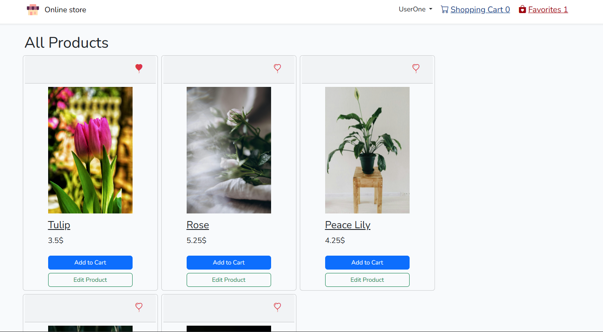
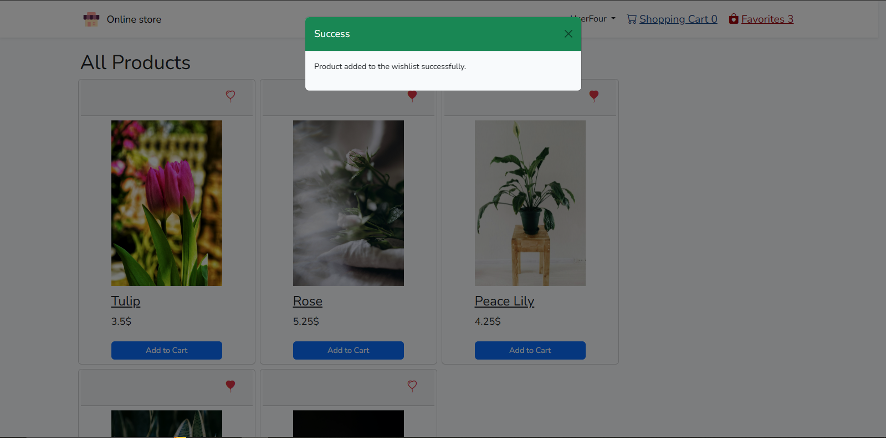

# Online store built with Laravel and MySQL

## Overview

A Laravel framework project using a MySQL database, including features such as: user authentication, adding products to the store, adding products to a wishlist or a shopping cart, leaving reviews and comments, placing orders.

## Functionality

The application provids features such as user authentication, adding products to the wishlist, adding products to the shopping cart, increasing/decreasing their quantity, placing an order, editing one's profile or writing reviews to a product.

### Using Laravel's MVC design pattern

Laravel uses a design pattern called MVC approach.

#### Model
    - the data layer of the application;
    - interacts with the database, performs data validation or manipulation;
    - models are used to retrieve and manipulate data from the database using Eloquent ORM, a powerfull tool for database interaction that provides an expressive and fluent syntax for defining database relationships and performing database operations;

Example of a model in my application: 

```php
class Address extends Model
{
    protected $guarded = []; // $guarded sets an array that contains the attributes that are not mass assignable, or cannot be set en masse with an Eloquent ORM method such as create();
    // by setting $guarded to an empty array, I allowed for all the attributes to be mass assigned;

    /**
     * The attributes that are mass assignable.
     *
     * @var array<int, string> //the attributes are integers and strings;
     */
    protected $fillable = [
        'city',
        'street',
        'number',
        'info',
    ];

    // defining a relationship between the Address Model and the User Model; in tis case, an address belongs to a user;
    public function user() 
    {
        return $this->belongsTo(User::class); 
    }
}
```

#### View
    - the presentation layer;
    - it is responsible for displaying the data to the user and user interface component handling;
    - in Laravel, views are written using it's deafult templating engine, Blade, that allows developers to write HTML templates with embadded PHP code, making it easier to create dynamic web pages;

Example of a view in my application:

```php
<div>
<h1>All Products</h1>
@if ($products->isEmpty())
        <p>No products found.</p>
    @else
    <div class='row row-cols-1 row-cols-md-2 row-cols-lg-4 g-2'>
        @foreach ($products as $product)
        <div class="card h-100" style="width: 20rem; margin-right: 0.5rem">
            <div class="card-header d-flex justify-content-end align-items-center">
                @if ($product->favorite)
                <form action="{{ route('favorites.remove', ['product_id' => $product->id]) }}" method="POST">
                    @csrf
                    @method('DELETE')
                    <button type="submit" class="btn">
                        <i class="bi bi-balloon-heart-fill text-danger fs-4"></i>
                    </button>
                </form>
                @else
                <form action="{{ route('favorites.store', ['product_id' => $product->id]) }}" method="POST">
                    @csrf
                    <button type="submit" class="btn">
                        <i class="bi bi-balloon-heart text-danger fs-4"></i>
                    </button>
                </form>
                @endif
            </div>
            <div class="d-flex flex-column justify-content-center align-items-center p-2">
                @include('components.cld-img', ['public_id'=>$product->photo_url, 'width'=> 200, 'height'=> 300])
                <a href="{{route('product', ['product'=>$product])}}" style="width: 12.5rem; size: 2.2rem; text-decorations:none; color: inherit; font-size: 1.5rem" class="d-flex justify-content-start align-items-center m-2 font-weight-bold">
                    {{$product->name}}</a>
                <h5 style="width: 12.5rem;" class="d-flex justify-content-start align-items-center">{{$product->price}}$
                </h5>
            </div>
            <div class="card-actions p-1 d-flex flex-column justify-content-center align-items-center">
                @if ($product->cart)
                <button disabled class="btn btn-primary btn-block p-1 m-1" style="width: 12.5rem;"
                    data-bs-toggle="tooltip" data-bs-placement="top" data-bs-custom-class="custom-tooltip"
                    data-bs-title="This product is already in your cart. Go there to change it's quantity.">
                    Add to Cart
                </button>
                @else

                <form action="{{ route('cart.store', ['product_id' => $product->id]) }}" method="POST">
                    @csrf
                    <button type="submit" class="btn btn-primary btn-block p-1 m-1" style="width: 12.5rem;">
                        Add to Cart
                    </button>
                </form>
                @endif
                @if(auth()->user()->role === "admin")
                <a href="{{ route('product.edit', ['product'=> $product->id])}}"
                    class="btn btn-outline-success btn-block p-1 m-1" style="width: 12.5rem;">
                    Edit Product
                </a>
                @endif
            </div>
        </div>
        @endforeach
    </div>
    @endif
</div>

```
and the way the products are displayed on the web page, when the user has the role of admin:



If the database has no products, the view will return an appropriate message. Otherwise, using the Blade directive foreach, for every product, a card will be created to display the data. If the user has the role of "admin", they will be shown a button that will redirect them to another page in order to edit the product. For the normal users, with the role of "user", they will have buttons to add the product to their wishlist or shopping cart.

#### Controller
    - the intermediary layer between the model and the view;
    - it recieves the input fro the user, processes it and interacts withthe model in order to retrieve or manipulate the data, then it passes the proccessed data to the view for display;
    - in Laravel, controllers are responsible for defining the application's routes and handling HTTP requests;

Example of a controller from my application:

```php
class ProductsController extends Controller
{
    public function store(Request $request)
    {
        try {
            $uuid = Str::uuid();
            $request->validate([
                'name' => ['required', 'string', 'max:50'],
                'price' => ['required', 'numeric', 'min:0'],
                'description' => ['required', 'string', 'max:400'],
                'photos.*' => ['nullable', 'image', 'max:2048'],
                'uuid' => ['nullable', 'string'],
            ]);

            if ($request->hasFile('photos')) {
                foreach ($request->file('photos') as $photo) {
                    $uploadedFile = $photo->getRealPath();
                    $uploadResult = Cloudinary::upload($uploadedFile);

                    $publicId = $uploadResult->getPublicId();

                    Photo::create([
                        'url' => $publicId,
                        'uuid' => $uuid,
                    ]);
                }
            } else {
                // If the admin does not upload any photos, this one will be assigned;
                $defaultUrl = 'pexels-pixabay-268349_onacrr';
                Photo::create([
                    'url' => $defaultUrl,
                    'uuid' => $uuid,
                ]);
            }

            Product::create([
                'name' => $request['name'],
                'price' => $request['price'],
                'description' => $request['description'],
                'uuid' => $uuid,
            ]);
            return back()->with('success', 'Product added successfully.');
        } catch (\Exception $e) {
            return back()->with('error', $e->getMessage());
        }
    }

    public function index($product)
    {
        try {
            $user = auth()->user();
            $product = Product::findOrFail($product);
            $photos = Photo::where('uuid', $product->uuid)->pluck('url');
            $favoritesCount = (new FavoritesController())->count();
            $cartCount = (new CartController())->count();
            $grade = 0;

            // Retrieve the product's reviews;
            $reviews = Reviews::where('product_id', $product->id)->get();
            $count = Reviews::where('product_id', $product->id)->count();
            foreach ($reviews as $review) {
                $review->comments = (new ReviewsController())->fetchReviewComments($review->id);
                $review->verified = (new ReviewsController())->checkIsVerified($review->id);
                $review->avatar = User::where('id', $review->user_id)->value('avatar');
                $review->name = User::where('id', $review->user_id)->value('name');
                $grade += $review->grade;
            }
            $count === 0 ? $product->grade = 0 : $product->grade = $grade / $count;
            $product->favorite = (new FavoritesController)->isInWishlist($product->id); /*checks if the product is in the wishlist;
based on whether or not the product is in the wishlist, the user will get option to remove/add the product from/to the wishlist
*/
            $product->cart = (new CartController())->isInCart($product->id); /*checks if the product is in the cart;*/
            return view('product.index', [
                'user' => $user,
                'product' => $product,
                'photos' => $photos,
                'favoritesCount' => $favoritesCount,
                'cartCount' => $cartCount,
                'reviews' => $reviews
            ]);
        } catch (\Exception $e) {
            return back()->with('error', $e->getMessage());
        }
    }

    public function edit($product)
    {
        try {
            $user = auth()->user();
            $product = Product::findOrFail($product);
            $photos = Photo::where('uuid', $product->uuid)->pluck('url');
            $favoritesCount = (new FavoritesController())->count();
            $cartCount = (new CartController())->count();
            return view('product.update', [
                'product' => $product,
                'user' => $user,
                'photos' => $photos,
                'favoritesCount' => $favoritesCount,
                'cartCount' => $cartCount
            ]);
        } catch (\Exception $e) {
            return back()->with('error', $e->getMessage());
        }
    }

    public function update(Request $request, Product $product, $uuid)
    {

        try {
            $validData = $request->validate([
                'name' => ['required', 'string', 'max:50'],
                'price' => ['required', 'numeric', 'min:0'],
                'description' => ['required', 'string', 'max:400'],
                'photos.*' => ['nullable', 'image', 'max:2048'],
            ]);

            if ($request->hasFile('photos')) {
                foreach ($request->file('photos') as $photo) {
                    $uploadedFile = $photo->getRealPath();
                    $uploadResult = Cloudinary::upload($uploadedFile);

                    $publicId = $uploadResult->getPublicId();

                    Photo::create([
                        'url' => $publicId,
                        'uuid' => $uuid
                    ]);
                }
            }
            $product->update($validData);
            return back()->with('success', 'Product edited successfully.');
        } catch (\Exception $e) {
            return back()->with('error', $e->getMessage());
        }
    }

    public function delete($product)
    {
        try {
            $product = Product::findOrFail($product);
            if (!$product) {
                return back()->with('error', 'Product not found.');
            }

            $photos = Photo::where('product_id', $product->id)->get();
            foreach ($photos as $photo) {
                (new PhotoController)->delete($photo->url);
            }
            $product->delete();
            $product->reviews()->delete();
            $product->comments()->delete();

            return back()->with('success', 'Product deleted successfully!');
        } catch (\Exception $ex) {
            return back()->with('error', $ex->getMessage());
        }
    }
}
```

### Handling error and success messages

For better interraction with the app, I have added to app.blade.php two modals, one for error display and one for messages of success.

```php
 <!-- Error Modal -->
<div class="modal fade" id="errorModal" tabindex="-1" aria-labelledby="errorModalLabel" aria-hidden="true">
    <div class="modal-dialog">
        <div class="modal-content">
            <div class="modal-header bg-danger text-white">
                <h5 class="modal-title" id="errorModalLabel">Error</h5>
                <button type="button" class="btn-close" data-bs-dismiss="modal" aria-label="Close"></button>
            </div>
            <div class="modal-body">
                <p>{{ session('error') }}</p>
            </div>
        </div>
    </div>
</div>
<!-- Success Modal -->
<div class="modal fade" id="successModal" tabindex="-1" aria-labelledby="successModalLabel" aria-hidden="true">
    <div class="modal-dialog">
        <div class="modal-content">
            <div class="modal-header bg-success text-white">
                <h5 class="modal-title" id="successModalLabel">Success</h5>
                <button type="button" class="btn-close" data-bs-dismiss="modal" aria-label="Close"></button>
            </div>
            <div class="modal-body">
                <p>{{ session('success') }}</p>
            </div>
        </div>
    </div>
</div>
</div>

@if(session('error'))
<input type="hidden" id="errorFlag" value="true">
@endif

@if(session('success'))
<input type="hidden" id="successFlag" value="true">
@endif
    @if(session('error'))
<input type="hidden" id="errorFlag" value="true">
@endif

@if(session('success'))
<input type="hidden" id="successFlag" value="true">
@endif


<script src="https://ajax.googleapis.com/ajax/libs/jquery/3.5.1/jquery.min.js"></script>
<script src="https://cdnjs.cloudflare.com/ajax/libs/bootstrap/5.3.0/js/bootstrap.bundle.min.js"></script>

<script>
    $(document).ready(function() {

        if ($('#errorFlag').val() === "true") {
            $('#errorModal').modal('show');
        }

        if ($('#successFlag').val() === "true") {
            $('#successModal').modal('show');
        }
    });
</script>
```
The modals are displayed in the browser like this: 




