# Online store built with Laravel and MySQL

## Overview

A Laravel framework project using a MySQL database, including features such as: user authentication, adding products to the store, adding products to a wishlist or a shopping cart, leaving reviews and comments, placing orders.

## Functionality

The application provides features such as user authentication, adding products to the wishlist, adding products to the shopping cart, increasing/decreasing their quantity, placing an order, editing one's profile or writing reviews to a product.

### Using Laravel's MVC design pattern

Laravel uses a design pattern called MVC approach.

#### Model
    - the data layer of the application;
    - interacts with the database, performs data validation or manipulation;
    - models are used to retrieve and manipulate data from the database using Eloquent ORM, a powerfull tool for database interaction that provides an expressive and fluent syntax for defining database relationships and performing database operations;

Example of a model in my application: 

```php
class Address extends Model
{
    protected $guarded = []; // $guarded sets an array that contains the attributes that are not mass assignable, or cannot be set en masse with an Eloquent ORM method such as create();
    // by setting $guarded to an empty array, I allowed for all the attributes to be mass assigned;

    /**
     * The attributes that are mass assignable.
     *
     * @var array<int, string> //the attributes are integers and strings;
     */
    protected $fillable = [
        'city',
        'street',
        'number',
        'info',
    ];

    // defining a relationship between the Address Model and the User Model; in tis case, an address belongs to a user;
    public function user() 
    {
        return $this->belongsTo(User::class); 
    }
}
```

#### View
    - the presentation layer;
    - it is responsible for displaying the data to the user and user interface component handling;
    - in Laravel, views are written using it's deafult templating engine, Blade, that allows developers to write HTML templates with embadded PHP code, making it easier to create dynamic web pages;

Example of a view in my application:

```php
<div>
<h1>All Products</h1>
@if ($products->isEmpty())
        <p>No products found.</p>
    @else
    <div class='row row-cols-1 row-cols-md-2 row-cols-lg-4 g-2'>
        @foreach ($products as $product)
        <div class="card h-100" style="width: 20rem; margin-right: 0.5rem">
            <div class="card-header d-flex justify-content-end align-items-center">
                @if ($product->favorite)
                <form action="{{ route('favorites.remove', ['product_id' => $product->id]) }}" method="POST">
                    @csrf
                    @method('DELETE')
                    <button type="submit" class="btn">
                        <i class="bi bi-balloon-heart-fill text-danger fs-4"></i>
                    </button>
                </form>
                @else
                <form action="{{ route('favorites.store', ['product_id' => $product->id]) }}" method="POST">
                    @csrf
                    <button type="submit" class="btn">
                        <i class="bi bi-balloon-heart text-danger fs-4"></i>
                    </button>
                </form>
                @endif
            </div>
            <div class="d-flex flex-column justify-content-center align-items-center p-2">
                @include('components.cld-img', ['public_id'=>$product->photo_url, 'width'=> 200, 'height'=> 300])
                <a href="{{route('product', ['product'=>$product])}}" style="width: 12.5rem; size: 2.2rem; text-decorations:none; color: inherit; font-size: 1.5rem" class="d-flex justify-content-start align-items-center m-2 font-weight-bold">
                    {{$product->name}}</a>
                <h5 style="width: 12.5rem;" class="d-flex justify-content-start align-items-center">{{$product->price}}$
                </h5>
            </div>
            <div class="card-actions p-1 d-flex flex-column justify-content-center align-items-center">
                @if ($product->cart)
                <button disabled class="btn btn-primary btn-block p-1 m-1" style="width: 12.5rem;"
                    data-bs-toggle="tooltip" data-bs-placement="top" data-bs-custom-class="custom-tooltip"
                    data-bs-title="This product is already in your cart. Go there to change it's quantity.">
                    Add to Cart
                </button>
                @else

                <form action="{{ route('cart.store', ['product_id' => $product->id]) }}" method="POST">
                    @csrf
                    <button type="submit" class="btn btn-primary btn-block p-1 m-1" style="width: 12.5rem;">
                        Add to Cart
                    </button>
                </form>
                @endif
                @if(auth()->user()->role === "admin")
                <a href="{{ route('product.edit', ['product'=> $product->id])}}"
                    class="btn btn-outline-success btn-block p-1 m-1" style="width: 12.5rem;">
                    Edit Product
                </a>
                @endif
            </div>
        </div>
        @endforeach
    </div>
    @endif
</div>

```
and the way the products are displayed on the web page, when the user has the role of admin:


If the database has no products, the view will return an appropriate message. Otherwise, using the Blade directive foreach, for every product, a card will be created to display the data. If the user has the role of "admin", they will be shown a button that will redirect them to another page in order to edit the product. For the normal users, with the role of "user", they will have buttons to add the product to their wishlist or shopping cart.

#### Controller
    - the intermediary layer between the model and the view;
    - it recieves the input fro the user, processes it and interacts withthe model in order to retrieve or manipulate the data, then it passes the proccessed data to the view for display;
    - in Laravel, controllers are responsible for defining the application's routes and handling HTTP requests;

Example of a controller from my application:

```php
class ProductsController extends Controller
{
    public function store(Request $request)
    {
        try {
            $uuid = Str::uuid();
            $request->validate([
                'name' => ['required', 'string', 'max:50'],
                'price' => ['required', 'numeric', 'min:0'],
                'description' => ['required', 'string', 'max:400'],
                'photos.*' => ['nullable', 'image', 'max:2048'],
                'uuid' => ['nullable', 'string'],
            ]);

            if ($request->hasFile('photos')) {
                foreach ($request->file('photos') as $photo) {
                    $uploadedFile = $photo->getRealPath();
                    $uploadResult = Cloudinary::upload($uploadedFile);

                    $publicId = $uploadResult->getPublicId();

                    Photo::create([
                        'url' => $publicId,
                        'uuid' => $uuid,
                    ]);
                }
            } else {
                // If the admin does not upload any photos, this one will be assigned;
                $defaultUrl = 'pexels-pixabay-268349_onacrr';
                Photo::create([
                    'url' => $defaultUrl,
                    'uuid' => $uuid,
                ]);
            }

            Product::create([
                'name' => $request['name'],
                'price' => $request['price'],
                'description' => $request['description'],
                'uuid' => $uuid,
            ]);
            return back()->with('success', 'Product added successfully.');
        } catch (\Exception $e) {
            return back()->with('error', $e->getMessage());
        }
    }

    public function index($product)
    {
        try {
            $user = auth()->user();
            $product = Product::findOrFail($product);
            $photos = Photo::where('uuid', $product->uuid)->pluck('url');
            $favoritesCount = (new FavoritesController())->count();
            $cartCount = (new CartController())->count();
            $grade = 0;

            // Retrieve the product's reviews;
            $reviews = Reviews::where('product_id', $product->id)->get();
            $count = Reviews::where('product_id', $product->id)->count();
            foreach ($reviews as $review) {
                $review->comments = (new ReviewsController())->fetchReviewComments($review->id);
                $review->verified = (new ReviewsController())->checkIsVerified($review->id);
                $review->avatar = User::where('id', $review->user_id)->value('avatar');
                $review->name = User::where('id', $review->user_id)->value('name');
                $grade += $review->grade;
            }
            $count === 0 ? $product->grade = 0 : $product->grade = $grade / $count;
            $product->favorite = (new FavoritesController)->isInWishlist($product->id); /*checks if the product is in the wishlist;
based on whether or not the product is in the wishlist, the user will get option to remove/add the product from/to the wishlist
*/
            $product->cart = (new CartController())->isInCart($product->id); /*checks if the product is in the cart;*/
            return view('product.index', [
                'user' => $user,
                'product' => $product,
                'photos' => $photos,
                'favoritesCount' => $favoritesCount,
                'cartCount' => $cartCount,
                'reviews' => $reviews
            ]);
        } catch (\Exception $e) {
            return back()->with('error', $e->getMessage());
        }
    }

    public function edit($product)
    {
        try {
            $user = auth()->user();
            $product = Product::findOrFail($product);
            $photos = Photo::where('uuid', $product->uuid)->pluck('url');
            $favoritesCount = (new FavoritesController())->count();
            $cartCount = (new CartController())->count();
            return view('product.update', [
                'product' => $product,
                'user' => $user,
                'photos' => $photos,
                'favoritesCount' => $favoritesCount,
                'cartCount' => $cartCount
            ]);
        } catch (\Exception $e) {
            return back()->with('error', $e->getMessage());
        }
    }

    public function update(Request $request, Product $product, $uuid)
    {

        try {
            $validData = $request->validate([
                'name' => ['required', 'string', 'max:50'],
                'price' => ['required', 'numeric', 'min:0'],
                'description' => ['required', 'string', 'max:400'],
                'photos.*' => ['nullable', 'image', 'max:2048'],
            ]);

            if ($request->hasFile('photos')) {
                foreach ($request->file('photos') as $photo) {
                    $uploadedFile = $photo->getRealPath();
                    $uploadResult = Cloudinary::upload($uploadedFile);

                    $publicId = $uploadResult->getPublicId();

                    Photo::create([
                        'url' => $publicId,
                        'uuid' => $uuid
                    ]);
                }
            }
            $product->update($validData);
            return back()->with('success', 'Product edited successfully.');
        } catch (\Exception $e) {
            return back()->with('error', $e->getMessage());
        }
    }

    public function delete($product)
    {
        try {
            $product = Product::findOrFail($product);
            if (!$product) {
                return back()->with('error', 'Product not found.');
            }

            $photos = Photo::where('product_id', $product->id)->get();
            foreach ($photos as $photo) {
                (new PhotoController)->delete($photo->url);
            }
            $product->delete();
            $product->reviews()->delete();
            $product->comments()->delete();

            return back()->with('success', 'Product deleted successfully!');
        } catch (\Exception $ex) {
            return back()->with('error', $ex->getMessage());
        }
    }
}
```

### Handling error and success messages

For better interraction with the app, I have added to app.blade.php two modals, one for error display and one for messages of success.

```php
 <!-- Error Modal -->
<div class="modal fade" id="errorModal" tabindex="-1" aria-labelledby="errorModalLabel" aria-hidden="true">
    <div class="modal-dialog">
        <div class="modal-content">
            <div class="modal-header bg-danger text-white">
                <h5 class="modal-title" id="errorModalLabel">Error</h5>
                <button type="button" class="btn-close" data-bs-dismiss="modal" aria-label="Close"></button>
            </div>
            <div class="modal-body">
                <p>{{ session('error') }}</p>
            </div>
        </div>
    </div>
</div>
<!-- Success Modal -->
<div class="modal fade" id="successModal" tabindex="-1" aria-labelledby="successModalLabel" aria-hidden="true">
    <div class="modal-dialog">
        <div class="modal-content">
            <div class="modal-header bg-success text-white">
                <h5 class="modal-title" id="successModalLabel">Success</h5>
                <button type="button" class="btn-close" data-bs-dismiss="modal" aria-label="Close"></button>
            </div>
            <div class="modal-body">
                <p>{{ session('success') }}</p>
            </div>
        </div>
    </div>
</div>
</div>

@if(session('error'))
<input type="hidden" id="errorFlag" value="true">
@endif

@if(session('success'))
<input type="hidden" id="successFlag" value="true">
@endif
    @if(session('error'))
<input type="hidden" id="errorFlag" value="true">
@endif

@if(session('success'))
<input type="hidden" id="successFlag" value="true">
@endif


<script src="https://ajax.googleapis.com/ajax/libs/jquery/3.5.1/jquery.min.js"></script>
<script src="https://cdnjs.cloudflare.com/ajax/libs/bootstrap/5.3.0/js/bootstrap.bundle.min.js"></script>

<script>
    $(document).ready(function() {

        if ($('#errorFlag').val() === "true") {
            $('#errorModal').modal('show');
        }

        if ($('#successFlag').val() === "true") {
            $('#successModal').modal('show');
        }
    });
</script>
```

The modals are displayed in the browser like this: 

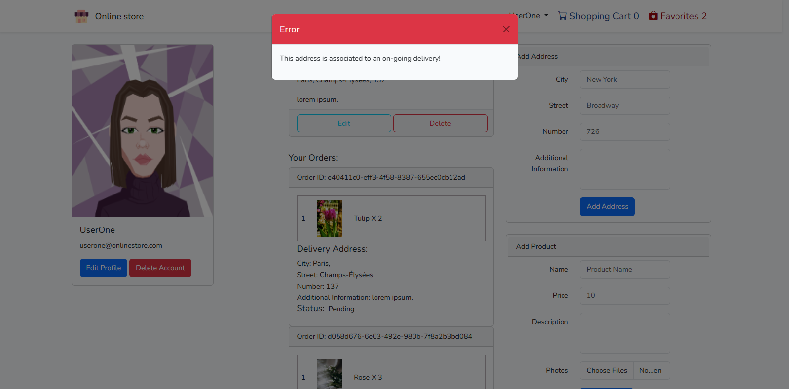


### Database and CRUD opperations

Considering that Laravel comes with built-in support for MySQL, and given that MySQL is a scalable database suitable for both smaller and larger projects, I have opted for it as the database solution for this project.

#### Database tables

Besides the tables added by Laravel's Auth feature, I have added several tables for this application: addresses, carts, comments, favorites, ordered_products, orders, photos, products, reviews.

### Table of contents
- [Addresses Management](#addresses-management)
- [Shopping Cart Management](#shopping-cart-management)
- [Comments Management](#comments-management)
- [Wishlist Management](#wishlist-management)
- [Orders Management](#orders-management)
- [Photos Management](#photos-management)
- [Products Management](#products-management)
- [Reviews Management](#reviews-management)
  
### Addresses Management

* **Table fields:** id, user_id, city, street, number, info.

The Addresses Controller is responsible for creating, displaying, updating and deleting a user's addresses. The user has the ability to add as many addresses as they want.

1. **store(Request $request):**
    - This method handles the creation of a new address for the logged in user.
    - It first validates the incoming request data, ensuring that the 'city', 'street', and 'number' fields are required and meet certain criteria, additional information is not required.
    - If the validation passes, it associates the new address with the authenticated user and returns a success message. If an error occurs during the process, it returns an error message.
  
   ```php
    public function store(Request $request)
    {
        try {
            $validatedData = $request->validate([
                'city' => ['required', 'string', 'max:50'],
                'street' => ['required', 'string', 'max:100'],
                'number' => ['required', 'numeric', 'min:0'],
                'info' => ['nullable', 'string', 'max:300'],
            ]);

            auth()->user()->addresses()->create($validatedData);
            return back()->with('success', 'Address added successfully.');
        } catch (\Exception $ex) {
            return back()->with('error', $ex->getMessage());
        }
    }
   ```

2. **show(User $user):**
    - This method retrieves and displays the addresses belonging to the authenticated user.
    - The addresses are displayed on the user's own page.
    - It takes a User model instance as a parameter and retrieves the addresses related to that user.
    - It then returns a view with the retrieved addresses. If an error occurs, it returns an error message.

```php
    public function show(User $user)
    {
        try {
            $addresses = $user->addresses()->get();
            return view('address.show', compact('addresses'));
        } catch (\Exception $ex) {
            return back()->with('error', $ex->getMessage());
        }
    }
```
3. **edit($address):**
    - This method handles the presentation of a form for editing an existing address.
    - It retrieves the authenticated user and finds the address based on the provided address ID.
    - It returns a view with the user, address, and counts of favorites and items in the cart. If an error occurs, it returns an error message.


```php
    public function edit($address)
    {
        try {
            $user = auth()->user();
            $address = Address::findOrFail($address);
            $favoritesCount = (new FavoritesController())->count();
            $cartCount = (new CartController())->count();
            return view('address.edit', [
                'user' => $user,
                'address' => $address,
                'favoritesCount' => $favoritesCount,
                'cartCount' => $cartCount
            ]);
        } catch (\Exception $ex) {
            return back()->with('error', $ex->getMessage());
        }
    }
```   
4. **update(Request $request, $address):**
    - This method updates an existing address based on the provided address ID.
    - It first finds the address to update, then validates the incoming request data.
    - If the validation passes, it updates the address with the new data and returns a success message. If an error occurs, it returns an error message.

```php
    public function update(Request $request, $address)
    {
        try {
            $address = Address::findOrFail($address);
            $validData = $request->validate([
                'city' => ['nullable', 'string', 'max:50'],
                'number' => ['nullable', 'numeric', 'min:1'],
                'street' => ['nullable', 'string', 'max:400'],
                'info' => ['nullable', 'string', 'max:400'],
            ]);
            $address->update($validData);
            return back()->with('success', 'Address updated successfully!');
        } catch (\Exception $ex) {
            return back()->with('error', $ex->getMessage());
        }
    }
```
5. **delete($address):**
    - This method deletes an existing address based on the provided address ID.
    - It finds the address to delete and deletes it from the database.
    - The deletion only takes place if the address is not assigned to an order that is pending or in transit. If the address is not used during an on-going delivery or is not used at all, it will be deleted.
    - If the deletion is successful, it returns a success message. If an error occurs, it returns an error message.
   ```php
     public function delete($address)
    {
        try {
            $address = Address::findOrFail($address);
            $id = $address->id;
            $order = Orders::where("address_id", $id)->first();
            if($order->exists() && $order->status !== "Delivered"){
                return back()->with('error', "This address is associated to an on-going delivery!");
            }
            $address->delete();
            return back()->with('success', 'Address deleted successfully!');
        } catch (\Exception $ex) {
            return back()->with('error', $ex->getMessage());
        }
    }
   ```

### Shopping Cart Management

**Table fields:**  id, user_id, product_id, quantity.

The Cart Controller is responsible for creating a shopping cart for the logged in user by adding products to it. The user, then, has the ability to remove products, increase or decrease their quanitities.

1. **index():**
   - This method retrieves and displays the user's shopping cart contents.
    - It fetches the authenticated user's products that they added to the shopping cart.
    - Retrieves product IDs from the cart associated with the user and fetches corresponding product details.
    - Calculates the total price of the items in the cart.
    - Returns a view with user details, cart contents, total price, and counts of favorites and items in the cart. If an error occurs, it returns an error message.


```php
  public function index()
    {
        try {
            $user = Auth::user();
            $favoritesCount = (new FavoritesController())->count();
            $cartCount = (new CartController())->count();

            $productIds = Cart::where("user_id", $user->id)->pluck("product_id")->toArray();
            $products = [];
            $cartTotal = (new CartController())->getTotalPrice($productIds);
            foreach ($productIds as $id) {
                $product = Product::find($id);
                $quantity = (new CartController())->getQuantity($id);
                $photo = Photo::where('uuid', $product->uuid)->first();
                $product->photo_url = $photo->url;
                $product->quantity = $quantity;
                $product->totalPrice = $product->quantity * $product->price;
                $products[] = $product;
            }
            return view("cart.index", [
                "user" => $user,
                "favoritesCount" => $favoritesCount,
                'cartCount' => $cartCount,
                'products' => $products,
                'cartTotal' => $cartTotal
            ]);
        } catch (\Exception $e) {
            return back()->with('error', $e->getMessage());
        }
    }
```

2. **store($productId)**:
    - This method adds a product to the user's shopping cart, by adding an instance of this product to the database.
    - It checks if the user is authenticated, creates a new entry in the cart table associating the user with the product and a quantity of 1.
    - Returns a success message if the addition is successful, otherwise returns an error message.
```php
    public function store($productId)
    {
        try {
            $userId = Auth::user()->id;
            if (!$userId) {
                return redirect()->to("/login");
            }
            Cart::create([
                'user_id' => $userId,
                'product_id' => $productId,
                'quantity' => 1,
            ]);
            return back()->with('success', 'Product added to the cart successfully.');
        } catch (\Exception $e) {
            return back()->with('error', $e->getMessage());
        }
    }
```

3. **increment($productId)/decrement($productId):**
    - This method increases/decresease the quantity of a product in the cart by one.
    - It calls the incrementQuantity()/decrementQuantity method, that cannot be called outside this class, to handle the increment/decrement operation.
  
```php
    public function increment($productId)
    {
        try {
            return $this->incrementQuantity($productId);
        } catch (\Exception $e) {
            return back()->with('error', $e->getMessage());
        }
    }
    private function incrementQuantity($productId)
    {
        try {
            $user = Auth::user();
            $product = Cart::where('product_id', $productId)->where('user_id', $user->id)->first();
            if (!$product) {
                return back()->with('error', 'Product not found in cart.');
            }
            $product->quantity += 1;
            $product->save();
        } catch (\Exception $e) {
            return back()->with('error', $e->getMessage());
        }
    }
    public function decrement($productId)
    {
        try {
            return $this->decrementQuantity($productId);
        } catch (\Exception $e) {
            return back()->with('error', $e->getMessage());
        }
    }
    private function decrementQuantity($productId)
    {
        try {
            $user = Auth::user();
            $product = Cart::where('product_id', $productId)->where('user_id', $user->id)->first();
            if (!$product) {
                return back()->with('error', 'Product not found in cart.');
            }
            if ($product->quantity == 1) {
                return back();
            }
            $product->quantity -= 1;
            $product->save();
        } catch (\Exception $e) {
            return back()->with('error', $e->getMessage());
        }
    }
```

4. **remove($product_id):**
    - This method removes a product from the user's shopping cart.
    - It deletes the corresponding entry from the cart table.
    - Returns a success message upon successful removal or an error message in case of an insuccessful removal.
    - Once an order is placed, all products from the cart are removed.
   ```php
          public function remove($product_id)
    {
        try {
            $user_id = Auth::user()->id;

            Cart::where('user_id', $user_id)
                ->where('product_id', $product_id)
                ->delete();
            return back()->with('success', 'Product eliminated from the wishlist');
        } catch (\Exception $e) {
            return back()->with('error', $e->getMessage());
        }
    }
   ```

5. **count():**
    - This method returns the count of items in the user's shopping cart.
    - It calls the private method cartCount() to handle the count operation.
    - The result is displayed in the application bar.
      
```php
    public function count()
    {
        try {
            return $this->cartCount();
        } catch (\Exception $e) {
            return back()->with('error', $e->getMessage());
        }
    }
    private function cartCount()
    {
        try {
            $user = Auth::user();
            $cartCount = Cart::where("user_id", $user->id)->count();
            return $cartCount;
        } catch (\Exception $e) {
            return back()->with('error', $e->getMessage());
        }
    }
```

6. **getQuantity(productId):**
    - This method retrieves the quantity of a specific product in the user's cart.
    - It calls the private method productQuantity() to handle the retrieval.
```php
    public function getQuantity($productId)
    {
        try {
            return $this->productQuantity($productId);
        } catch (\Exception $e) {
            return back()->with('error', $e->getMessage());
        }
    }

    private function productQuantity($productId)
    {
        try {
            $user = Auth::user();
            $product = Product::findOrFail($productId);
            $quantity = Cart::where("user_id", $user->id)
                ->where("product_id", $product->id)
                ->value("quantity");
            return $quantity ?? 0;
        } catch (\Exception $e) {
            \Log::error('Error in getQuantity function: ' . $e->getMessage());
            return back()->with("error", $e->getMessage());
        }
    }
```

7. **getTotalPrice(array $productIds):**
    - This method calculates the total price of all products in the user's cart.
    - It calls the private metho totalPrice() to return the total price.
    - 
```php
    public function getTotalPrice(array $productIds)
    {
        try {
            return $this->totalPrice($productIds);
        } catch (\Exception $e) {
            return back()->with('error', $e->getMessage());
        }
    }

    private function totalPrice(array $productIds)
    {
        try {
            $cartTotal = 0;
            foreach ($productIds as $productId) {
                $product = Product::find($productId);
                if (!$product) {
                    continue;
                }
                $productQuantity = (new CartController)->getQuantity($product->id);
                $cartTotal += $product->price * $productQuantity;
            }
            return $cartTotal;
        } catch (\Exception $e) {
            return back()->with('error', $e->getMessage());
        }
    }
```

8. **isInCart($productId):**
    - This method checks if a product is already in the user's shopping cart by calling the private method inCart($productId).
    - It returns a boolean indicating whether the product is in the cart or not.
    - It is used in the ProductController. Thanks to this method, each product, when fetched, gets a new field, a boolean called 'cart' that determines what methods are used when the user interacts with the application. If the product is in the shopping cart, all buttons "Add to Cart" will be disabled on the frontend.

```php
 public function isInCart($productId)
    {
        try {
            return $this->inCart($productId);
        } catch (\Exception $e) {
            return back()->with('error', $e->getMessage());
        }
    }
    private function inCart($productId)
    {
        try {
            $userId = auth()->user()->id;
            if (!$userId) {
                return redirect()->to('/login');
            }
            $product = Cart::where('product_id', $productId)->where('user_id', $userId)
                ->exists();
            return $product;
        } catch (\Exception $e) {
            return back()->with('error', $e->getMessage());
        }
    }
```

### Comments Management

**Table fields:** user_id, product_id, review_id, content 

The Comments Controller is responsible for adding, removing and updating comments to the database. The user can comment under a review. They can edit and remove only their own comments. The user can add as many comment as they want.

1. **store(Request $request, $productId, $reviewId):**
    - This method handles the creation of a new comment.
    - It takes two parents: the id of the review the user wants to respond to and the id of the product the review belongs to. This way, the comment will be displayed on the correct page, under the correct review and, if the product will ever be deleted, the comment will also be deleted.
    - It first checks if the user is authenticated. If not, it returns an error message.
    - It then checks if both the product and the review exist. If either is not found, it returns an error message.
    - It validates the content of the comment.
    - If validation passes, it creates a new comment associated with the user, product, and review.
    - It returns a success message upon successful creation, or an error message if an exception occurs.


```php
  public function store(Request $request, $productId, $reviewId)
    {
        try {
            $user = auth()->user();
            if (!$user) {
                return back()->with("error", "User Not Found.");
            }

            // Checking if the product and the review do exist
            $product = Product::find($productId);
            $review = Reviews::find($reviewId);
            if (!$product || !$review) {
                return back()->with("error", "Product or Review Not Found.");
            }

            $request->validate([
                "content" => ['nullable', 'string', 'max:500'],
            ]);

            Comments::create([
                'content' => $request->content,
                'user_id' => $user->id,
                'product_id' => $productId,
                'review_id' => $reviewId,
            ]);
            return back()->with('success', 'Comment submitted successfully.');
        } catch (\Exception $ex) {
            return back()->with('error', $ex->getMessage());
        }
    }
```

2. **update(Request $request, Comments $comment):**
    - This method handles the updating of an existing comment.
    - It checks if the comment exists. If not, it returns an error message.
    - If the content of the request is not null, it updates the content of the comment.
    - It saves the updated comment and returns a success message upon successful update, or an error message if an exception occurs.
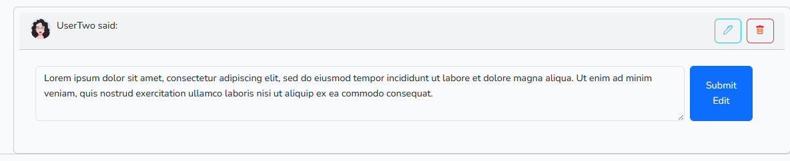
```php
 public function update(Request $request, Comments $comment)
    {
        try {
            if (!$comment) {
                return back()->with("error", "Comment not found.");
            }
            if ($request['content'] !== null) {
                $comment->content = $request['content'];
            }
            $comment->save();
            return back()->with('success', 'Comment edited successfully!');
        } catch (\Exception $ex) {
            return back()->with('error', $ex->getMessage());
        }
    }
```

3. **delete($comment):**
    - This method handles the deletion of an existing comment.
    - It attempts to find the comment based on the provided comment ID. If not found, it throws a ModelNotFoundException.
    - If the comment is found, it deletes the comment.
    - It returns a success message upon successful deletion, or an error message if the comment is not found.
```php
  public function delete($comment)
    {
        try {
            $comment = Comments::findOrFail($comment);
            $comment->delete();
            return back()->with('success', 'Comment deleted successfully!');
        } catch (\Exception $e) {
            return back()->with('error', 'Comment not found.');
        }
    }
```

### Wishlist Management

**Table fields:** id, user_id, product_id

The Favrites Controller is responsible for ensuring that the user has a wishlist. The user can add or remove products from their wishlist. When the products are displayed, controller also checks if the logged in user has the product in the wishlist and that ensures the user gets the functionality needed.

1. **index():**
    - This method retrieves and displays the user's favorite products, and thus, creating the wihlist page.
    - It first checks if the user is authenticated. If not, it redirects to the login page.
    - It retrieves the IDs of the products favorited by the user and fetches corresponding product details.
    - It constructs an array of products with their photo URLs, so that the product card has a thumbnail.
    - Finally, it returns a view with user details, favorite products, and counts of favorites and items in the cart. If an error occurs, it returns an error message.
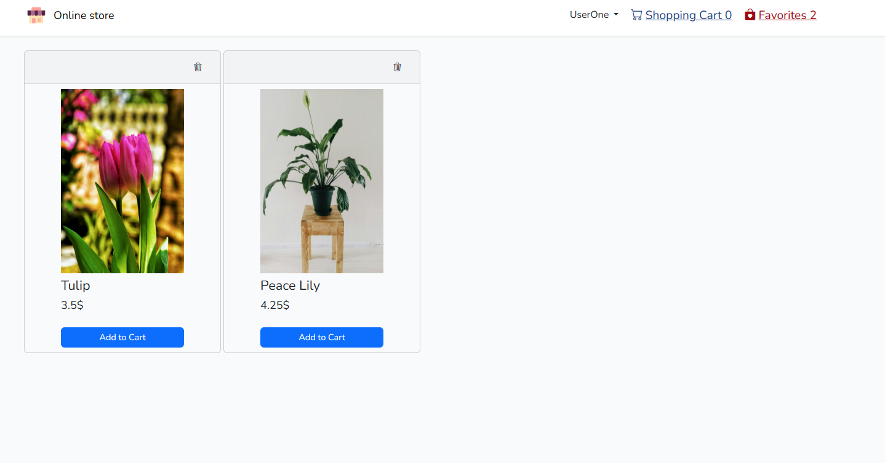
```php
 public function index()
    {
        try {
            $user = Auth::user();
            if (!$user) {
                return redirect()->to("/login");
            }
            $productId = Favorites::where("user_id", $user->id)->pluck("product_id")->toArray();
            $products = [];
            foreach ($productId as $id) {
                $product = Product::find($id);
                $photo = Photo::where('uuid', $product->uuid)->first();
                $product->photo_url = $photo->url;
                $products[] = $product;
            }
            $favoritesCount = (new FavoritesController())->count();
            $cartCount = (new CartController())->count();
            return view("favorites.index", [
                "user" => $user,
                "products" => $products,
                'favoritesCount' => $favoritesCount,
                'cartCount' => $cartCount
            ]);
        } catch (\Exception $e) {
            return back()->with('error', $e->getMessage());
        }
    }
```

2. **store($productId):**
    - This method creates a new instance of a wishlist item.
    - It checks if the user is authenticated. If not, it redirects to the login page.
    - It creates a new entry in the favorites table associating the user with the product.
    - It returns a success message upon successful addition, or an error message if an exception occurs.
```php
public function store($productId)
    {
        try {
            $userId = Auth::user()->id;
            if (!$userId) {
                return redirect()->to("/login");
            }
            Favorites::create([
                'user_id' => $userId,
                'product_id' => $productId,
            ]);
            return back()->with('success', 'Product added to the wishlist successfully.');
        } catch (\Exception $e) {
            return back()->with('error', $e->getMessage());
        }

    }
```
3. **remove():**
    - This method removes a product from the user's wishlist.
    - It deletes the corresponding entry from the favorites table.
    - Returns a success message upon successful removal.
    - This method can only be accessed when the product is already in the wishlist.
```php
 public function remove($product_id)
    {
        try {
            $user_id = Auth::user()->id;

            Favorites::where('user_id', $user_id)
                ->where('product_id', $product_id)
                ->delete();
            return back()->with('success', 'Product eliminated from the wishlist');
        } catch (\Exception $e) {
            return back()->with('error', $e->getMessage());
        }
    }
```
4. **isInWishlist($productId):**
   -  This method checks if a product is already in the user's favorites.
    - It returns a boolean indicating whether the product is in the favorites or not.

```php
public function isInWishlist($productId)
    {
        try {
            return $this->inWishlist($productId);
        } catch (\Exception $e) {
            return back()->with('error', $e->getMessage());
        }
    }
    private function inWishlist($productId)
    {
        try {
            $userId = auth()->user()->id;
            if (!$userId) {
                return redirect()->to('/login');
            }
            $favorite = Favorites::where('product_id', $productId)->where('user_id', $userId)
                ->exists();
            return $favorite;
        } catch (\Exception $e) {
            return back()->with('error', $e->getMessage());
        }
    }
```

The buttons that are used to add or remove a product from the user's wishlist, based on whether or not the product was already added.

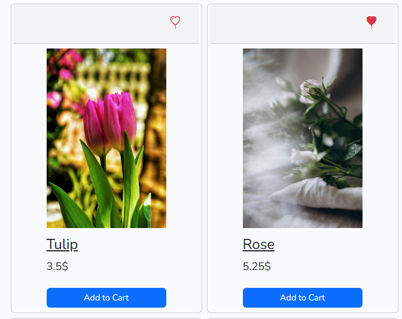

5. **count():**
    - Method that returns the number of products in the logged in user's wishlist.
    - It calls the private method favoritesCount().
    - The result is displayed in the application bar.
      
   ```php
       public function count()
    {
        try {
            return $this->favoritesCount();
        } catch (\Exception $e) {
            return back()->with('error', $e->getMessage());
        }
    }
    private function favoritesCount()
    {
        try {
            $userId = Auth::user()->id;
            $favoritesCount = Favorites::where('user_id', $userId)->count();
            return $favoritesCount;
        } catch (\Exception $e) {
            return back()->with('error', $e->getMessage());
        }
    }
   ```

### Orders Management

**Table fields:** id, user_id, address_id, status, paying_method, uuid, price

The Orders Controller is responsible for saving each order to the database. Every order is connected to instances in the ordered_products table through an uuid, so that, when a user wants to leave a review, the controller can check if the user bought the product or not. The user can make an order, but only an user with the role of "admin" has the ability to update the order. The orders are listed on a separate page, only available to admins.

1. **store(Request $request):**
    - This method handles the creation of a new order.
    - It first retrieves the authenticated user and generates a UUID for the order.
    - It fetches the product IDs from the user's cart.
    - For each product, it creates an entry in the ordered_products table, associating the product with the user and the order UUID.
    - It calculates the total price of the order using the getTotalPrice() method from the CartController.
    - It creates an entry in the Orders table with details such as user ID, UUID, price, address ID, status, and paying method.
    - If the order creation is successful, it removes the products from the user's cart and returns a success message. Otherwise, it returns an error message.
  
```php
public function store(Request $request)
    {
        try {
            $user = Auth::user();
            $uuid = Str::uuid();
            $productIds = Cart::where("user_id", $user->id)->pluck("product_id")->toArray();
            foreach ($productIds as $productId) {
                $product = Cart::where("product_id", $productId)->first();
                OrderedProducts::create([
                    "product_id" => $productId,
                    "user_id" => $user->id,
                    "uuid" => $uuid,
                    'quantity' => $product->quantity,
                ]);
            }
            $price = (new CartController)->getTotalPrice($productIds);
            $order = Orders::create([
                "user_id" => $user->id,
                "uuid" => $uuid,
                'price' => $price,
                "address_id" => $request['address'],
                "status" => 'Pending',
                'paying_method' => $request['paying-method']
            ]);
            if (!$order->exists()) {
                return back()->with("error", "Something went wrong.");
            }
            ;
            foreach ($productIds as $productId) {
                (new CartController)->remove($productId);
            }
            return back()->with("success", "Order placed successfully!");
        } catch (\Exception $e) {
            return back()->with("error", $e->getMessage());
        }
    }
```

2. **show():**
    - This method retrieves and displays all orders on a page only available to an user that has the role of "admin".
    - It fetches the authenticated user and all orders from the Orders table.
    - For each order, it retrieves the associated products using the getProducts() method.
    - It also retrieves the associated address for each order.
    - Finally, it returns a view with user details, orders, counts of favorites and items in the cart.
  
```php
public function show()
    {
        try {
            $user = auth()->user();
            $orders = Orders::all();
            $favoritesCount = (new FavoritesController)->count();
            $cartCount = (new CartController)->count();
            foreach ($orders as $order) {
                $order->products = (new OrdersController)->getProducts($order->id);
                $order->phoneNumber = User::where('id', $order->user_id)->pluck('phone-number')->first();
                $order->name = User::where('id', $order->user_id)->pluck('name')->first();
                $order->email = User::where('id', $order->user_id)->pluck('email')->first();
                $address = Address::where("id", $order->address_id)->first();
                if($address)
                {
                    $order->address = $address;
                }
            }
            return view("orders.show", [
                "orders" => $orders,
                "favoritesCount" => $favoritesCount,
                "cartCount" => $cartCount,
                'user' => $user
            ]);
        } catch (\Exception $ex) {
            return back()->with('error', $ex->getMessage());
        }
    }
```
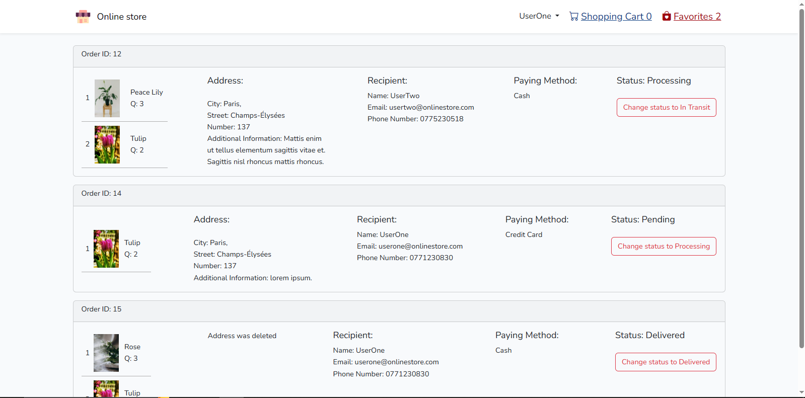

3. **update(Orders $order):**
   - This method updates the status of an existing order.
    - It first checks if the order exists. If not, it returns an error message.
    - It updates the status of the order based on its current status.
    - It saves the updated order and returns a success message upon successful update, or an error message if an exception occurs.
      
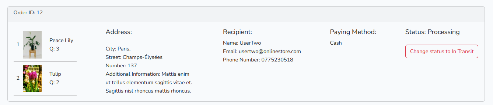

```php
public function update(Orders $order)
    {
        try {
            $order = Orders::find($order->id);
            if (!$order) {
                return back()->with('error', 'Order not found.');
            }
            if ($order->status === 'Pending') {
                $order->status = 'Processing';
            } else if ($order->status === 'Processing') {
                $order->status = 'In transit';
            } else {
                $order->status = "Delivered";
            }
            $order->save();
            return back()->with("success", "Order updated successfully!");
        } catch (\Exception $ex) {
            return back()->with("error", $ex->getMessage());
        }
    }
```

4. **getProducts($orderId):**
    - This method retrieves the products associated with a specific order.
    - It fetches the order from the Orders table based on the provided order ID.
    - It retrieves the product IDs associated with the order from the OrderedProducts table, through the common uuid.
    - For each product, it fetches the corresponding product details, including photos and quantity.
    - It returns an array of products associated with the order.
    - It calls the private method getOrderProducts($orderId).

```php
    public function getProducts($orderId)
    {
        try {
            return $this->getOrderProducts($orderId);
        } catch (\Exception $ex) {
            return back()->with("error", $ex->getMessage());
        }
    }

    private function getOrderProducts($orderId)
    {
        try {
            $order = Orders::find($orderId);
            if (!$order) {
                return back()->with("error", "Order not found.");
            }
            $productIds = OrderedProducts::where("uuid", $order->uuid)->pluck('product_id')->toArray();
            $products = [];
            foreach ($productIds as $productId) {
                $product = Product::find($productId);
                if ($product) {
                    $product->photos = Photo::where('uuid', $product->uuid)->pluck('url')->toArray();
                    $product->quantity = OrderedProducts::where("product_id", $product->id)->value("quantity");
                    $products[] = $product;
                }
            }
            return $products;
        } catch (\Exception $ex) {
            return back()->with("error", $ex->getMessage());
        }
    }
```

### Photos Management

**Table fields:** id, uuid, url

The Photo Controller is responsible for the deletion of the photos associated to a product. The photos are uploaded to Cloudinary and their public id is saved to the database under the field 'url'. In order to display them, I have created a component that I used whenever I needed to display an image. 

```php
@props(['public_id','width', 'height'])

@php
$imageUrl = cloudinary()->getImage($public_id)->toUrl();
@endphp


```

1. **delete($public_id):**
   - Method that deletes the photo from the photos table from the database, as well as from Cloudinary.
   - If the photo is not found, it returns an error message.
   - If the deletion is successful according to the API response, it deletes the photo record from the database and returns a success message.
   - If the deletion fails, it returns an error message.
   - If an exception occurs during the process, it returns an error message containing the exception message.

```php
public function delete($public_id)
    {
        try {

            $photo = Photo::where("url", $public_id);

            if (!$photo) {
                return back()->with("error", "Photo not found.");
            }

            $result = (new AdminApi())->deleteAssets(
                $public_id,
                ["resource_type" => "image", "type" => "upload"]
            );

            if ($result) {
                $photo->delete();
                return back()->with('success', 'Photo deleted successfully.');
            } else {
                return back()->with('error', 'Could not delete the photo.');
            }
        } catch (\Exception $ex) {
            return back()->with('error', $ex->getMessage());
        }
    }
```

### Products Management

**Table fields:** id, uuid, name, price, description

The Products Controller is responsible for the management of the store's products. An user with the role of 'admin' has the ability to add a product to the database through a form that asks for the name, price, description of the product. The admin can also add multiple photos. Each photo will be saved to a Cloudinary collection and it's public_id will be saved to the photos table in the MySQL database. The product and the photos associated to it are linked through an uuid. The administartor can edit the product, which means they can delete existing photos or add new ones, change the name, price or description of the product. The admin also has the ability to delete the product.

1. **store(Request $request):**
    - This method handles the creation of a new product.
    - It generates a UUID for the product that will create a link between the product and it's photos.
    - It validates the incoming request data, including name, price, description, and photos.
    - If photos are uploaded, it uploads them to Cloudinary and stores the public IDs in the photos table from the database along with the UUID.
    - If no photos are uploaded, it assigns a default photo URL.
    - It creates a new product record in the database with the validated data and the generated UUID.
    - Upon successful creation, it returns a success message. If an exception occurs during the process, it returns an error message.

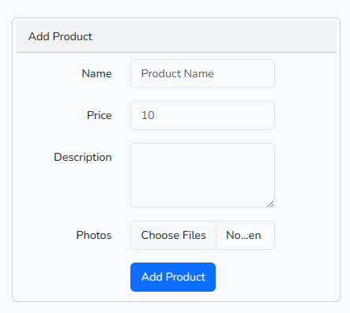
```php
    public function store(Request $request)
    {
        try {
            $uuid = Str::uuid();
            $request->validate([
                'name' => ['required', 'string', 'max:50'],
                'price' => ['required', 'numeric', 'min:0'],
                'description' => ['required', 'string', 'max:400'],
                'photos.*' => ['nullable', 'image', 'max:2048'],
                'uuid' => ['nullable', 'string'],
            ]);

            if ($request->hasFile('photos')) {
                foreach ($request->file('photos') as $photo) {
                    $uploadedFile = $photo->getRealPath();
                    $uploadResult = Cloudinary::upload($uploadedFile);

                    $publicId = $uploadResult->getPublicId();

                    Photo::create([
                        'url' => $publicId,
                        'uuid' => $uuid,
                    ]);
                }
            } else {
                // If the admin does not upload any photos, this one will be assigned;
                $defaultUrl = 'pexels-pixabay-268349_onacrr';
                Photo::create([
                    'url' => $defaultUrl,
                    'uuid' => $uuid,
                ]);
            }

            Product::create([
                'name' => $request['name'],
                'price' => $request['price'],
                'description' => $request['description'],
                'uuid' => $uuid,
            ]);
            return back()->with('success', 'Product added successfully.');
        } catch (\Exception $e) {
            return back()->with('error', $e->getMessage());
        }
    }
```
2. **index($product):**
    - This method retrieves and displays a specific product.
    - It fetches the authenticated user and the product based on the provided product ID.
    - It retrieves photos associated with the product.
    - It calculates the average grade of the product based on its reviews.
    - It checks if the product is favorited and if it's in the user's cart.
    - It returns a view with user details, the product, associated photos, and reviews. This will be translated into the product's page on the frontend.

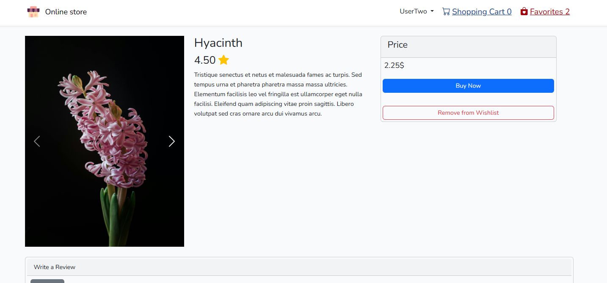

```php
public function index($product)
    {
        try {
            $user = auth()->user();
            $product = Product::findOrFail($product);
            $photos = Photo::where('uuid', $product->uuid)->pluck('url');
            $favoritesCount = (new FavoritesController())->count();
            $cartCount = (new CartController())->count();
            $grade = 0;

            // Retrieve the product's reviews;
            $reviews = Reviews::where('product_id', $product->id)->get();
            $count = Reviews::where('product_id', $product->id)->count();
            foreach ($reviews as $review) {
                $review->comments = (new ReviewsController())->fetchReviewComments($review->id);
                $review->verified = (new ReviewsController())->checkIsVerified($review->id);
                $review->avatar = User::where('id', $review->user_id)->value('avatar');
                $review->name = User::where('id', $review->user_id)->value('name');
                $grade += $review->grade;
            }
            $count === 0 ? $product->grade = 0 : $product->grade = $grade / $count;
            $product->favorite = (new FavoritesController)->isInWishlist($product->id); /*checks if the product is in the wishlist;
based on whether or not the product is in the wishlist, the user will get option to remove/add the product from/to the wishlist
*/
            $product->cart = (new CartController())->isInCart($product->id); /*checks if the product is in the cart;*/
            return view('product.index', [
                'user' => $user,
                'product' => $product,
                'photos' => $photos,
                'favoritesCount' => $favoritesCount,
                'cartCount' => $cartCount,
                'reviews' => $reviews
            ]);
        } catch (\Exception $e) {
            return back()->with('error', $e->getMessage());
        }
    }
```

3. **edit($product):**
    - This method retrieves and displays the form to edit a specific product.
    - It fetches the authenticated user and the product based on the provided product ID.
    - It retrieves photos associated with the product.
    - It returns a view with the product, user details, associated photos, and counts of favorites and items in the cart.
  
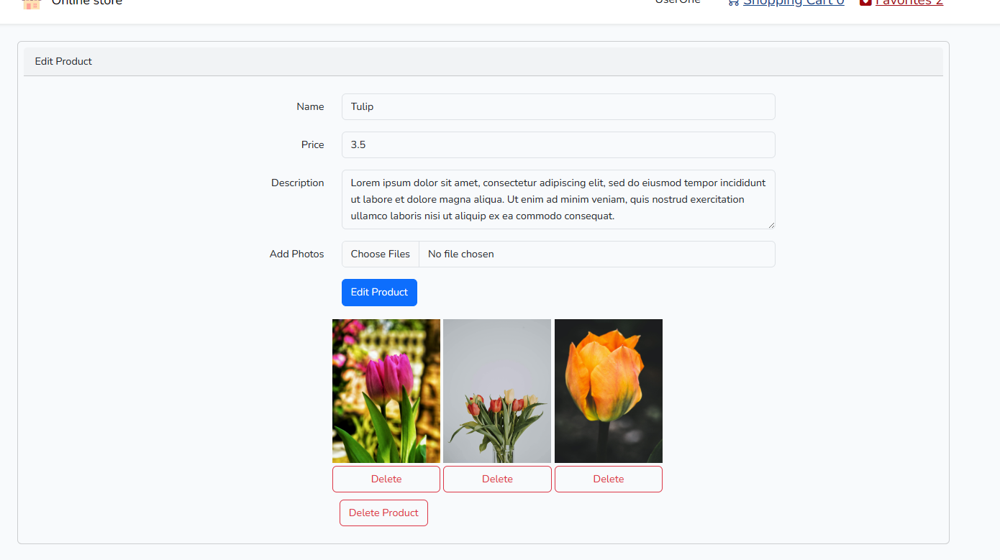

```php
public function edit($product)
    {
        try {
            $user = auth()->user();
            $product = Product::findOrFail($product);
            $photos = Photo::where('uuid', $product->uuid)->pluck('url');
            $favoritesCount = (new FavoritesController())->count();
            $cartCount = (new CartController())->count();
            return view('product.update', [
                'product' => $product,
                'user' => $user,
                'photos' => $photos,
                'favoritesCount' => $favoritesCount,
                'cartCount' => $cartCount
            ]);
        } catch (\Exception $e) {
            return back()->with('error', $e->getMessage());
        }
    }
```
4. **update(Request $request, Product $product, $uuid):**
    - This method handles the updating of an existing product.
    - It validates the incoming request data, including name, price, description, and photos.
    - If photos are uploaded, it uploads them to Cloudinary and stores the public IDs in the Photo model along with the UUID.
    - It updates the product record in the database with the validated data.
    - Upon successful update, it returns a message of success. If an exception occurs during the process, it returns an error message.

   ```php
    public function update(Request $request, Product $product, $uuid)
    {

        try {
            $validData = $request->validate([
                'name' => ['required', 'string', 'max:50'],
                'price' => ['required', 'numeric', 'min:0'],
                'description' => ['required', 'string', 'max:400'],
                'photos.*' => ['nullable', 'image', 'max:2048'],
            ]);

            if ($request->hasFile('photos')) {
                foreach ($request->file('photos') as $photo) {
                    $uploadedFile = $photo->getRealPath();
                    $uploadResult = Cloudinary::upload($uploadedFile);

                    $publicId = $uploadResult->getPublicId();

                    Photo::create([
                        'url' => $publicId,
                        'uuid' => $uuid
                    ]);
                }
            }
            $product->update($validData);
            return back()->with('success', 'Product edited successfully.');
        } catch (\Exception $e) {
            return back()->with('error', $e->getMessage());
        }
    }
   ```
5. **delete($product):**
    - This method handles the deletion of a specific product.
    - It fetches the product based on the provided product ID.
    - It retrieves associated photos and deletes them from Cloudinary and from the photos table in the database using the delete() method from the PhotoController.
    - It deletes the product record from the database along with its reviews and comments.
    - Upon successful deletion, it returns a success message. If an exception occurs during the process, it returns an error message.
  
```php
public function delete($product)
    {
        try {
            $product = Product::findOrFail($product);
            if (!$product) {
                return back()->with('error', 'Product not found.');
            }

            $photos = Photo::where('product_id', $product->id)->get();
            foreach ($photos as $photo) {
                (new PhotoController)->delete($photo->url);
            }
            $product->delete();
            $product->reviews()->delete();
            $product->comments()->delete();

            return back()->with('success', 'Product deleted successfully!');
        } catch (\Exception $ex) {
            return back()->with('error', $ex->getMessage());
        }
    }
```

### Reviews Management

**Table fields:** id, user_id, product_id, content, grade

The Reviews Controller is responsible for the creation, updating, displaying, and deletion of the reviews. An user can leave a single review under each product. In order to give more accuracy to a review, it is checked if the user had bought the product. The user can edit or delete their own review. Each review is retrieved alongside all the responses it got.

1. **store(Request $request, $productId):**
    - This method handles the creation of a new review for a product.
    - It retrieves the authenticated user.
    - It checks if the user exists. If not, it returns an error message.
    - It checks if the user has already reviewed the product. If yes, it returns an error message.
    - It validates the incoming request data, including content and grade.
    - It creates a new review record in the database with the validated data and the provided product ID.
    - Upon successful creation, it returns a success message. If an exception occurs during the process, it returns an error message.
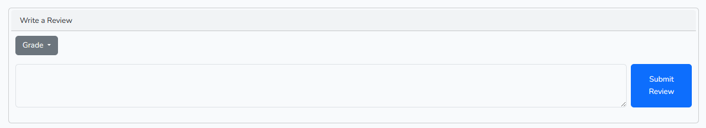
```php
 public function store(Request $request, $productId)
    {
        try {
            $user = Auth::user();
            if ($user->exists == false) {
                return back()->with("error", "User Not Found.");
            }
            $check = Reviews::where("user_id", $user->id)->where("product_id", $productId)->exists();
            if ($check) {
                return back()->with("error", "You already reviewed this product.");
            }
            $request->validate([
                "content" => ['nullable', 'string', 'max:500'],
                'grade' => ['required', 'numeric'],
            ]);

            Reviews::create([
                'content' => $request->content,
                'user_id' => $user->id,
                'product_id' => $productId,
                'grade' => $request->grade,
            ]);
            return back()->with('success', 'Review added successfully.');
        } catch (\Exception $e) {
            return back()->with('error','Error while trying to add te review: '.$e->getMessage());
        }
    }
```

2. **fetchReviewComments($reviewId):**
    - This method retrieves comments associated with a specific review.
    - It calls for the private method getComments($reviewId) to perform the retrieval.
    - It retrieves comments based on the provided review ID.
    - For each comment, it retrieves the associated user's avatar and name.
    - It returns the retrieved comments. If an exception occurs during the process, it returns an error message.

```php public function fetchReviewComments($reviewId){
        try {
            return $this->getComments($reviewId);
        } catch (\Exception $e) {
            return back()->with('error', $e->getMessage());
        }
    }
    private function getComments($reviewId)
    {
        try {
            $comments = Comments::where("review_id", $reviewId)->get();
            foreach ($comments as $comment) {
                $user = User::find($comment->user_id);
                if ($user->exists == false) {
                    return back()->with("error", "User not found");
                }
                $comment->avatar = $user->avatar;
                $comment->name = $user->name;
            }
            return $comments;
        } catch (\Exception $e) {
            return back()->with("error", $e->getMessage());
        }
    }
```
3. **checkIsVerified($reviewId):**
    - This method checks if a purchase is verified, meaning if the reviewer has bought the product.
    - It delegates to the private method isVerified($reviewId) to perform the verification.
    - It retrieves the review based on the provided review ID.
    - It checks if there exists an ordered product associated with the same user and product ID as the review.
    - It returns a boolean value indicating whether the purchase is verified. If an exception occurs during the process, it returns an error message.

```php
public function checkIsVerified($reviewId)
{
    try {
        return $this->isVerified($reviewId);
    } catch (\Exception $e) {
        return back()->with("error", $e->getMessage());
    }
}
private function isVerified($reviewId)
    {
        try {
            $review = Reviews::find($reviewId);
            $verified = OrderedProducts::where("user_id", $review->user_id)->where("product_id", $review->product_id)->exists();
            return $verified;
        } catch (\Exception $e) {
            return back()->with("error", $e->getMessage());
        }
    }
```
4. **update(Request $request, Reviews $review):**
    - This method handles the updating of an existing review.
    - It retrieves the review based on the provided review object.
    - It updates the review content and grade based on the incoming request data.
    - Upon successful update, it returns a success message. If an exception occurs during the process, it returns an error message.
  
```php
    public function update(Request $request, Reviews $review)
    {
        try {
            if (!$review) {
                return back()->with("error", "Review not found.");
            }
            $review->content = $request->input('content', $review->content);
            $review->grade = $request->input('grade', $review->grade);

            $review->save();

            return back()->with('success', 'Review edited successfully!');
        } catch (\Exception $e) {
            return back()->with('error', $e->getMessage());
        }
    }
```
5. **delete($review):**
    - This method handles the deletion of a specific review.
    - It fetches the review based on the provided review ID.
    - It deletes the review record from the database.
    - Upon successful deletion, it returns a success message. If an exception occurs during the process, it returns an error message.
  
```php
  public function delete($review)
    {
        try {
            $review = Reviews::findOrFail($review);
            $review->delete();
            return back()->with('success', 'Review deleted successfully!');
        } catch (\Exception $ex) {
            return back()->with('error', 'Error while looking for you review: ' . $ex->getMessage());
        }
    }
```

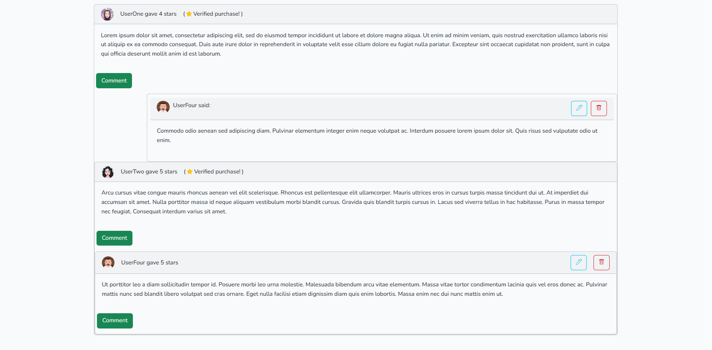
